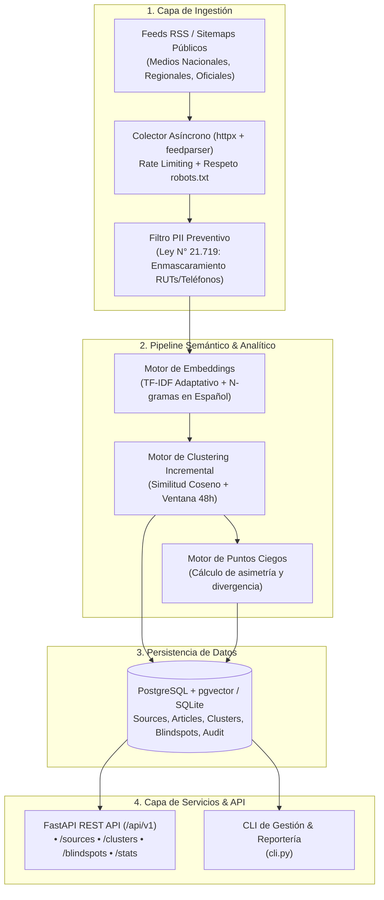

# Observatorio de Información Pública Digital de Chile 🇨🇱

Plataforma modular de observabilidad, análisis de sesgo, deduplicación de eventos fácticos y detección de **Puntos Ciegos (Blindspots)** en el ecosistema de medios e información pública en Chile.

---

## 🏛️ Fundamento Epistemológico y Metodología

La plataforma renuncia expresamente a la pretensión de dictaminar una "verdad algorítmica unívoca" y adopta el principio de **Transparencia Estructural y Metodológica** (inspirado en iniciativas internacionales como *Ground News* y *Media Cloud*):

1. **Deduplicación Fáctica**: Agrupa múltiples despachos de distintos medios bajo un mismo suceso noticioso subyacente.
2. **Mapeo del Espectro Editorial**: Sitúa a cada medio según su orientación histórica (`izquierda`, `centro`, `derecha`, `investigación no alineada`, `institucional`).
3. **Transparencia Corporativa**: Hace visible la pertenencia de cada medio a grupos empresariales, familias controladoras o financiamiento estatal.
4. **Detección de Puntos Ciegos (Blindspot Engine)**: Mide asimetrías matemáticas cuando una noticia es cubierta profusamente por un sector del espectro político pero omitida o minimizada por el sector opuesto.

---

## ⚖️ Cumplimiento del Marco Normativo Chileno

| Marco Legal | Obligación Técnica | Implementación en la Plataforma |
| :--- | :--- | :--- |
| **Ley N° 21.719** *(Protección de Datos Personales)* | *Privacy by Design*, exclusión de datos sensibles de ciudadanos comunes y canales ARCO. | Sanitizador preventivo (`PIIFilter`) que detecta y enmascara automáticamente RUTs, teléfonos particulares y correos privados antes de persistir. |
| **Ley N° 21.459** *(Delitos Informáticos / Convenio de Budapest)* | Prohibición de acceso ilícito, saturación abusiva o vulneración perimetral. | Ingestión pasiva basada en RSS/Sitemaps públicos, cabeceras `User-Agent` de identificación, límites de tasa (*rate limiting* de 1s por host) y respeto a `robots.txt`. |
| **Ley N° 17.336** *(Propiedad Intelectual)* | Prohibición de *mirroring* o redistribución de textos completos. | Excepción de derecho de cita (Art. 71B): resúmenes sintéticos multi-ángulo, citas breves y redirección de tráfico al medio original. |

---

## 🏗️ Arquitectura del Sistema



---

## 🚀 Instalación y Puesta en Marcha

### 1. Requisitos
* Python 3.10+
* Dependencias requeridas: `fastapi`, `uvicorn`, `feedparser`, `sqlalchemy`, `pydantic-settings`, `beautifulsoup4`, `numpy`, `pytest`.

### 2. Comandos CLI

```bash
# 1. Inicializar base de datos y sembrar catálogo de medios chilenos
python cli.py init-db

# 2. Recolectar noticias en vivo desde medios chilenos
python cli.py ingest --limit 10

# 3. Agrupar noticias en clusters y calcular puntos ciegos
python cli.py cluster

# 4. Ver reporte de estado y asimetrías de cobertura
python cli.py report

# 5. Ejecutar ciclo completo (ingesta + clustering + reporte)
python cli.py pipeline --limit 15

# 6. Levantar servidor API REST
python cli.py serve --port 8000
```

---

## 📡 Endpoints de la API REST

* `GET /api/v1/sources`: Directorio y fichas de transparencia de medios chilenos.
* `GET /api/v1/sources/{slug}`: Ficha de propiedad corporativa, línea editorial y noticias recientes.
* `GET /api/v1/clusters`: Listado de eventos fácticos deduplicados con filtros y buscador.
* `GET /api/v1/clusters/{id}`: Detalle de un evento, artículos vinculados y desglose de cobertura.
* `GET /api/v1/clusters/{id}/brief`: Informe neutral multi-ángulo con derecho de cita y enlaces originales.
* `GET /api/v1/blindspots`: Eventos catalogados como Puntos Ciegos activos en la agenda pública.
* `GET /api/v1/stats`: Estadísticas globales de cobertura y pluralidad.
* `POST /api/v1/ingest/trigger`: Disparador de recolección en segundo plano.

Documentación interactiva disponible en: `http://127.0.0.1:8000/docs`.

---

## 🧪 Ejecución de Pruebas Automatizadas

```bash
python -m pytest tests -v
```
